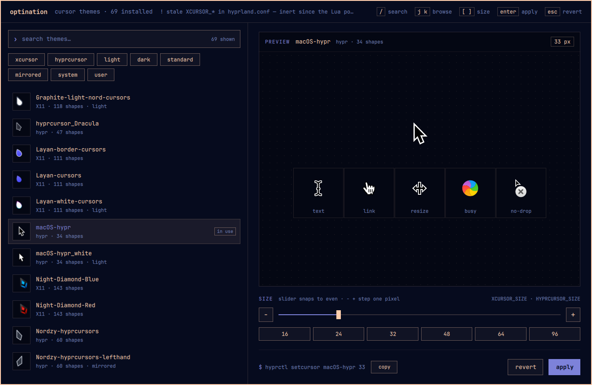

# optination

A cursor theme picker for Hyprland that shows you the cursors.

Choosing a cursor theme from a numbered list is guesswork — `Quintom_Ink` and
`Quintom_Snow` are just two words until you can see them. optination lists every
theme on the system with its actual pointer, I-beam, hand, resize, busy and
no-drop shapes rendered at the size you are about to use, applies your pick to
the live pointer the moment you click it, and only writes to disk when you say so.



## One overlay, two hosts

The picker is a single QML overlay (`qml/Picker.qml`) run by
[Quickshell](https://quickshell.org). Only the host around it differs:

| Where | Host | Colours |
|---|---|---|
| Omarchy | an overlay plugin inside the running `omarchy-shell` (`qml/omarchy/`) | the shell's live `[menu]` theme tokens — follows every theme switch |
| any other Hyprland | its own short-lived Quickshell instance (`qml/standalone/`) | Omarchy's `colors.toml` if present, otherwise built-in dark defaults |

`optination` with no arguments picks the right one and toggles it. Inside
Omarchy it never starts a second Quickshell — the plugin lives in the shell
that is already running. Outside it, the instance quits when the picker closes,
so nothing idles in the background.

The Rust binary is the engine behind both: it finds themes, renders their
shapes to PNGs under `$XDG_CACHE_HOME/optination/` (reused until a theme's
directory changes), and applies the choice. The overlay drives it through the
`--json` flags below.

## As an Omarchy plugin

Plugin id `io.github.lubabs770.optination`, kind `overlay`, entry point
`qml/Overlay.qml`; `manifest.json` sits at the repo root. The plugin is only
the UI — it drives the `optination` binary, found on `PATH` or in
`~/.local/bin`. If the binary is missing the picker opens with a message saying
so instead of an empty list.

```sh
./install.sh                                   # binary + QML, links and enables the plugin
omarchy-shell shell toggle io.github.lubabs770.optination
omarchy plugin remove io.github.lubabs770.optination   # unlinks; nothing else is touched
```

**What it writes:** nothing on open or while browsing except the live pointer
(`hyprctl setcursor`, `gsettings`). **Apply** writes the marked block in
`looknfeel.lua` described under *Applying*. Its own files are a PNG cache in
`$XDG_CACHE_HOME/optination/` and the list width in
`$XDG_STATE_HOME/optination/ui.json`. It never edits keybindings or menu
extensions.

**Trust boundary:** everything read from the engine is size-capped and
shape-checked before use, images load only from its own cache directory, all
text renders as plain text, and every command runs as an argument vector — no
shell strings built from theme names.

**Closing:** Esc, a click outside the card, or `optination` again. Like
Omarchy's own overlays it does not respond to Super+W: Hyprland handles that
bind as *close window* before the overlay sees the key.

## Keys

| Key | Does |
|---|---|
| `/` | search (Enter or Esc to leave the field) |
| `j` `k` / `↓` `↑` | browse; the pointer under your hand follows |
| `[` `]` | size −1 / +1 px |
| Enter | apply and persist |
| Esc | revert to what was active when it opened, and close |

The slider snaps to even sizes and the size buttons jump; `−` `+` and `[` `]`
move a single pixel, so an odd size is reachable. The theme list's width is
draggable and remembered in `$XDG_STATE_HOME/optination/ui.json`.

## Why

It replaces a shell function that had two problems beyond being blind:

- **It could only see half the themes.** It globbed for `*/cursors/`, which is
  the Xcursor layout. Every hyprcursor theme — `manifest.hl` plus
  `hyprcursors/*.hlc` — was invisible to it. On the machine it was written for
  that was 16 of 69 themes.
- **Its "make permanent" wrote to a file nothing reads.** It appended
  `env = XCURSOR_THEME,…` to `~/.config/hypr/hyprland.conf`, which Omarchy 4
  stopped reading when the Hyprland config moved to Lua. The setting looked
  saved and silently was not.

## What it handles

| Format | Layout | Assets |
|---|---|---|
| Xcursor | `<theme>/cursors/<shape>` | binary, pre-rasterized ARGB at fixed sizes |
| hyprcursor | `<theme>/manifest.{hl,toml}` + `<theme>/hyprcursors/<shape>.hlc` | zip of `meta.hl` + SVG **or** PNG |

Both manifest dialects and both hyprcursor asset kinds are real and in the wild;
a picker that only handles `manifest.hl` or only handles SVG will quietly drop
themes.

## Filtering

A search box over name, comment, format and tone, plus chips:

| Group | Chips | Derived from |
|---|---|---|
| Format | `X11`, `hyprcursor` | which directories the theme ships |
| Tone | `light`, `dark` | a `light`/`white`/`dark` word in the theme name |
| Handedness | `standard`, `mirrored` | a `right`/`lefthand` word in the theme name |
| Source | `system`, `user` | `/usr/share/icons` vs. under `$HOME` |

Chips within a group are OR-ed and the groups are AND-ed, so `hyprcursor` + `dark`
narrows to dark hyprcursor themes instead of producing the empty set. A group with
nothing checked places no constraint.

Tone and handedness are read off the theme *name*, which is the only place the
information is recorded — a theme that declares neither stays untagged rather than
being guessed at from its pixels.

## Missing shapes

Not every theme defines every shape. Where one is absent the preview cell shows a
dash rather than an unexplained hole, and `--check` lists it:

```
$ optination --check 32
rose-pine-hyprcursor                     missing: busy
1 theme(s) with an undrawable preview slot at 32px
```

That is a gap in the *theme* — Hyprland will fall back to another theme's shape at
runtime — and this is how you find out before committing to it. A shape that
decodes but rasterizes to fully transparent pixels counts as missing too, since on
screen the two are the same thing.

## Applying

Three consumers need telling, and none of them covers the others:

| Mechanism | Reaches | Lifetime |
|---|---|---|
| `hyprctl setcursor` | Hyprland's own pointer | immediate, until reload |
| `gsettings set org.gnome.desktop.interface cursor-theme` | GTK apps, settings portal | the session |
| `hl.env("XCURSOR_THEME", …)` in `~/.config/hypr/looknfeel.lua` | every client's environment | permanent |

Clicking a theme does the first two, so the pointer under your hand changes while
you browse. **Apply** adds the third, writing a marked block:

```lua
-- >>> optination (managed block) >>>
hl.env("XCURSOR_THEME", "Bibata-Modern-Ice")
hl.env("XCURSOR_SIZE", "30")
hl.env("HYPRCURSOR_THEME", "Bibata-Modern-Ice")
hl.env("HYPRCURSOR_SIZE", "30")
-- <<< optination (managed block) <<<
```

Rewritten in place on each save, never duplicated, with a timestamped backup of
the file alongside it. `looknfeel.lua` is a user file that Omarchy loads after
its own defaults, so the `XCURSOR_SIZE` in `default/hypr/envs.lua` is overridden
rather than fought with. After writing, `hyprctl reload` and
`hyprctl configerrors` run, and a config error is reported instead of waiting to
bite at next login.

**Revert** (or Esc, or clicking outside the card) puts back whatever was set when
the picker opened, so trying things on live is free.

## CLI

The thing this replaced was a shell function, and shell functions get called
from scripts.

```
optination                          open (or close) the picker overlay
optination --list                   every theme found: name, format, shape count
optination --check [SIZE]           report which preview shapes a theme cannot draw
optination --apply <THEME> [SIZE]   apply for this session
optination --save  <THEME> [SIZE]   apply and persist
optination --current                print the active theme and size
optination --render <THEME> <SIZE>  render the six preview shapes to the cache
optination --thumbs                 render every theme's list thumbnail to the cache
optination --stale                  report a stale XCURSOR_* line in hyprland.conf
```

Add `--json` to `--list`, `--current`, `--render`, `--thumbs` or `--stale` for
the machine format the overlay reads.

`--check` reports gaps in the *themes*, not in optination — a theme with no
`wait`/`watch` shape will fall back to another theme's at runtime, and this is
how you find that out before you commit to it.

## Build

CI builds every push and uploads the `optination-linux-x86_64` artifact: the
binary, `qml/`, `share/` and `install.sh`. Unpack it and run:

```sh
./install.sh
```

That puts the binary in `~/.local/bin`, the QML in
`~/.local/share/optination/qml`, and the desktop entry and icon where the
launcher finds them. On Omarchy it also links the QML in as the plugin
`io.github.lubabs770.optination` and enables it. From a checkout, build with
`cargo build --release` first; `install.sh` picks up `target/release/optination`.

To open it from a key, bind `optination` — e.g. in `~/.config/hypr/bindings.lua`
on Omarchy — or add a row to `~/.config/omarchy/extensions/omarchy-menu.jsonc`:

```jsonc
"style.cursor": {"icon":"󰇀","label":"Cursor","action":"optination"}
```

Runtime needs: Quickshell (Omarchy ships it; elsewhere `pacman -S quickshell`),
`hyprctl`, `gsettings`, and `wl-copy` for the copy button. Xcursor parsing via
`xcursor`, SVG via `resvg`, PNG via `png`, hyprcursor archives via `zip`.

## Notes

- Cursors are drawn at their true pixel size — the preview is the thing itself,
  not an approximation of it.
- For themes shipping both formats, the hyprcursor version is previewed, since
  that is the one Hyprland will actually use.

## License

MIT.
